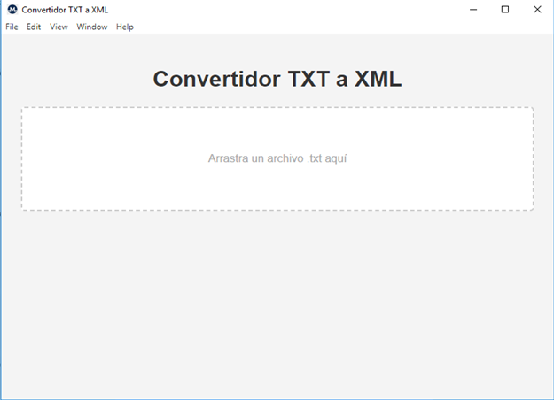

# Convertidor-TXT-XML
Software libre para conversión de listas de picos MALDI-TOF MS del tipo generado por Vitek MS / Saramis RUO a XML compatible con la base de datos pública MicrobeNet.

---

## Descripción
**Convertidor TXT-XML** es una aplicación liviana y de ejecución local diseñada para transformar archivos `.txt` con listas de picos MALDI-TOF MS generadas por sistemas como Vitek MS / Saramis RUO a formato XML compatible con la base de datos pública **MicrobeNet (CDC).**

El software fue desarrollado con foco en:
- simplicidad de uso,
- procesamiento rápido,
- compatibilidad,
- ejecución local sin dependencia de servicios externos,
- y distribución libre para fines académicos, científicos y técnicos.

---

## Características principales
- Conversión de archivos `.txt` a `.xml`
- Compatibilidad con MicrobeNet
- Soporte drag and drop
- Ejecución local
- Interfaz simple y liviana
- No requiere conexión permanente a internet
- Distribución gratuita
- Compatible con Windows 64 bits

---

## Capturas de pantalla

<p align="center">
  
</p>

---

## Descarga
La descarga del instalador se encuentra disponible desde la página oficial del proyecto:

### [Descargar Convertidor-TXT-XML](https://dariogodoy2003.github.io/Convertidor-TXT-XML/)

---

## Manual de Usuario
El manual completo en PDF se encuentra disponible en:

### [Abrir Manual de Usuario PDF](https://dariogodoy2003.github.io/Convertidor-TXT-XML/manual/Manual_de_uso_Convertidor-TXT-XML.pdf)

---

## Instalación
1. Descargar el instalador
2. Ejecutar Setup
3. Seguir las instrucciones en pantalla
4. Iniciar el programa desde el acceso directo creado

---

## Integridad del archivo
SHA256 del instalador actual:
```text
f2229277f031ef7cbe0799a50df35faec0cadf5c7903d601994b7c3f125913a9
```

---

## Registro
El formulario de registro solicitado previo a la descarga tiene fines exclusivamente estadísticos y académicos, permitiendo conocer distribución geográfica y cantidad aproximada de usuarios.

Sin fines comerciales.

---

## Requisitos
- Windows 64 bits
- Permisos de ejecución locales

---

## Estado del proyecto
**Version actual:**`v1.0`

Proyecto en desarrollo y mejora continua.

---

## Licencia
Este software se distribuye bajo licencia MIT.

---

## Autor
Desarrollado por **Dario A. Godoy**.

---

## Registro legal
Software registrado ante la Dirección Nacional de Derechos de Autor (DNDA), República Argentina, conforme a la Ley 11.723 de Propiedad Intelectual.
